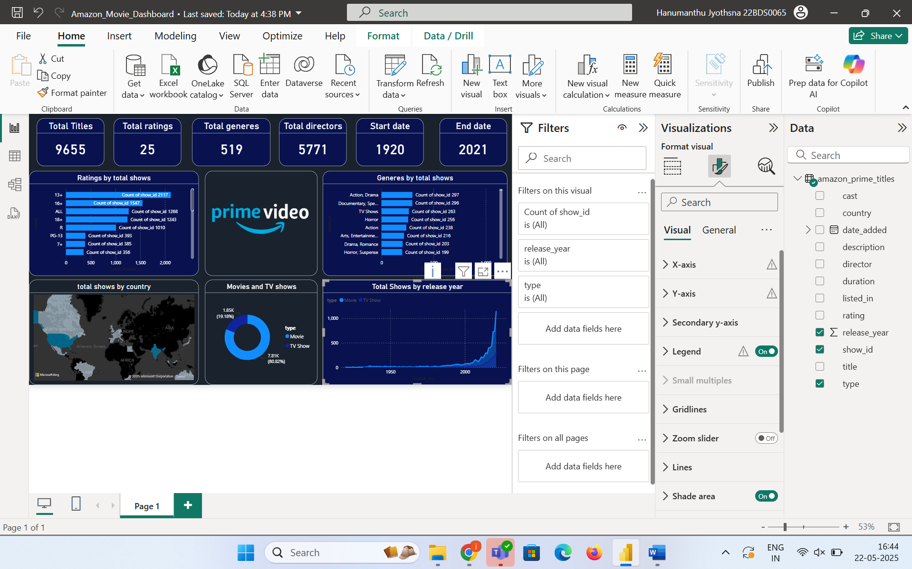
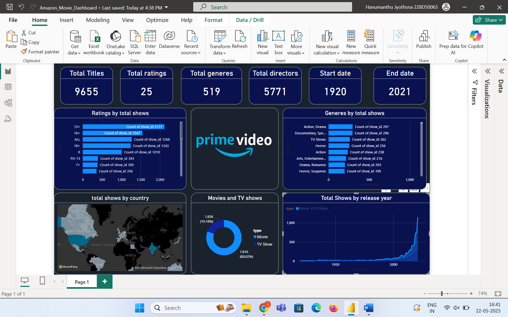

# 🎬 Amazon Prime Movie & TV Show Dashboard 📊

Welcome to the **Amazon Prime Movie & TV Show Dashboard** — an interactive Power BI project that provides deep insights into the content available on Amazon Prime Video. This dashboard is designed to help users explore data visually across various dimensions such as ratings, genres, years, countries, and content type.

## 📌 Project Objective

The goal of this project is to analyze the **Amazon Prime Video** catalog and uncover patterns related to:
- Total number of shows/movies available
- Ratings distribution
- Genre diversity
- Year-wise content production trends
- Country-wise content distribution
- Comparison of Movies vs. TV Shows

It helps decision-makers, content creators, and entertainment enthusiasts understand trends and user preferences over time.

## 📁 Project Files

| File Name                     | Description                                        |
|------------------------------|----------------------------------------------------|
| `Amazon_Movie_Dashboard.pbix` | Power BI file with the interactive dashboard       |
| `preview.png`                | Screenshot preview of the dashboard                |
| `amazon_prime_dataset.csv`   | The cleaned dataset used for visualization         |
| `README.md`                  | Description and documentation of the project       |

## 🧾 Dataset Information

This dataset was sourced from [Kaggle](https://www.kaggle.com/datasets/shivamb/amazon-prime-movies-and-tv-shows) and contains metadata on thousands of movies and TV shows available on Amazon Prime. The dataset includes:

- Title
- Type (Movie or TV Show)
- Release Year
- Age Rating (e.g., 13+, 18+, PG, R)
- Genre
- Country of production
- Duration
- Description
- Cast & Directors

🔗 **Link to Dataset:**  
👉 [Amazon Prime Movies and TV Shows on Kaggle](https://www.kaggle.com/datasets/shivamb/amazon-prime-movies-and-tv-shows)

## 📊 Dashboard Features

Here are the major components of the dashboard:

### ✅ KPI Cards:
- **Total Titles:** 9655+
- **Total Ratings:** 25 unique categories
- **Total Genres:** 519+
- **Total Directors:** 5700+
- **Start & End Dates:** Spanning from 1920 to 2021

### ✅ Bar Charts:
- Ratings distribution by total shows
- Genre-wise show counts

### ✅ Pie Chart:
- Breakdown of content type: Movies vs TV Shows

### ✅ Map:
- Country-wise content availability visualization

### ✅ Time Series Line Chart:
- Number of shows released each year from 1920 to 2021

2. **Open Power BI File**  
Launch `Amazon_Movie_Dashboard.pbix` in Power BI Desktop.

3. **Explore the Dashboard**  
Interact with filters, visuals, and hover over charts to uncover hidden insights.

## 📌 Key Insights

📌 The number of shows has significantly increased post-2010, reflecting the rise in digital streaming.

📌 Most shows fall under genres like **Action, Drama, Horror**, and **Romance**.

📌 Age ratings like **13+** and **16+** dominate the content classification.

📌 United States, India, and UK lead the content production.

📌 A large majority of content consists of **TV Shows**, highlighting Amazon's focus on episodic content.

## 👩‍💻 About the Author
**Hanumanthu Jyothsna**  
💡 Data Science Enthusiast | Power BI Developer

